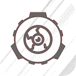

# SCP - Viewer 2 source:

------


> [!WARNING]
>
> :zap:*This code is crap, open at your own risk.*:zap:

* unity version: ``` 6000.0.24f1 ```;
* Actual application source version: ``` 0.39a Alpha ```;
* Min-max Android API: ``` 6.0 +```.

# Quick about project:

------

<div align="center"> Application published here: <a href='https://play.google.com/store/apps/details?id=com.URODEngine.SCPViewer2&amp;hl=ru'>Google play</a> </div>



------

<div align="center"> Project preview:  </div>


------

<div align="center"> Desctiption:  </div>

Welcome to the SCP complex!
Scarily interesting monsters, people, objects are waiting for you in this game.
Recreated containment cells with their strangest inhabitants, taken from the SCP Foundation Wiki
The game is based on secret documents of the SCP Foundation.
SCP (Secure, Contain, Protect) - contains information about objects, creatures, locations and events.

The application has 4 localizations:
• English (SCP Foundation EN)
• Russian (SCP Foundation RU)
• Italian (Online translation)
• Arabic (Online translation)

The game contains:
- SCP in their containment chambers
- SCP has its own behavior, taken from the SCP Wiki source
- Buttons for experiments in containment chambers
- Atmospheric GUI, taken straight from the SCP games
- The game does not require the Internet

Materials collected from the following sources:
• http://www.scp-wiki.net/
• http://scpfoundation.net/
• http://ko.scp-wiki.net/
• http://scp-pt-br.wikidot.com/
• http: // scp-cs.wikidot.com/
// The materials provided are not documentary in nature and are fiction. People with a weak nervous system, pregnant women and especially sensitive categories of people should avoid the materials of this application.
// This application is designed to monitor creatures and objects taken from the materials presented on the above-mentioned sites! The application is not a product of the SCP Foundation. It does not process or publish materials on the organization's websites. This application is only a convenient tool for monitoring creatures and objects in the SCP Foundation universe!)
//Content related to the SCP Foundation, including the SCP Foundation logo, is licensed under a Creative Commons Sharealike 3.0 license, and the concepts come from http://www.scpwiki.com and its contributors. SCP - VIEWER, recreated from this content, is also licensed under a Creative Commons Sharealike 3.0 license. The author of SCP-VIEWER is not the author of the SCP Foundation and is not the founder of the idea.
